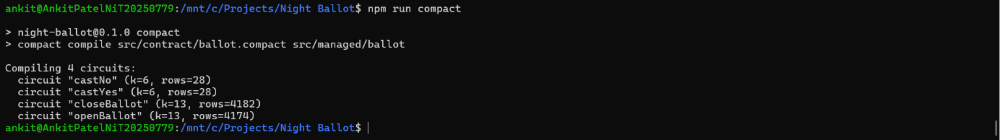

# Night Ballot

A privacy-preserving on-chain ballot built on [Midnight](https://midnight.network/) using zero-knowledge proofs.  
Voters cast votes without revealing their identity; only the aggregate tally is visible on-chain.

---

## Product Idea

**Night Ballot** is a trustless, anonymous voting platform for DAOs, community organizations, and on-chain governance.  
Any organizer can create a proposal, collect yes/no votes from eligible participants, and publish a final tally — all without any voter ever revealing _who_ they are.  
The organizer's identity is committed via a ZK proof (a hash on-chain, secret key never exposed), preventing ballot hijacking while keeping the process fully transparent.  
Because the zero-knowledge circuit proves vote integrity without leaking personal data, Night Ballot is suitable for scenarios where voter anonymity is not just a preference but a requirement: corporate whistleblower polls, anonymous grant reviews, or privacy-critical community referenda.

---

## How It Works: Public State vs. Private Witness

### Public Ledger State

Everything stored under `export ledger` in `ballot.compact` is visible to anyone who queries the Midnight blockchain:

| Field | Type | Description |
|---|---|---|
| `proposal` | `Maybe<Opaque<"string">>` | The ballot question |
| `yesVotes` | `Counter` | Running YES count |
| `noVotes` | `Counter` | Running NO count |
| `isOpen` | `Field` | `1` = voting open, `0` = closed |
| `organizer` | `Bytes<32>` | SHA-256 commitment of organizer's key |

### Private Witness

```compact
witness organizerKey(): Bytes<32>;
```

`organizerKey()` is declared as a **witness** — a TypeScript function that runs locally on the prover's machine. Its return value is consumed by the ZK circuit to generate a proof, but it is **never transmitted to the network** and never appears on-chain.

When the organizer closes the ballot, the circuit asserts:

```compact
assert(
  organizer == ballotKey(organizerKey()),
  "Only the original organizer can close this ballot"
);
```

The chain verifies this assertion by checking the proof, not by seeing the key. The actual key remains private.

### `disclose()` — Deliberate Disclosure

Compact is **private by default**: any value that flows through a `witness` function is private.  
`disclose()` is the explicit opt-in to make a value public. Without it, the compiler rejects the assignment:

```compact
// ✓ OK — we intentionally write the hashed key to the public ledger
organizer = disclose(ballotKey(organizerKey()));

// ✓ OK — we intentionally write the question text publicly
proposal  = disclose(some<Opaque<"string">>(question));

// ✓ OK — we intentionally flip the flag publicly
isOpen    = disclose(1 as Field);
```

`Counter.increment()` does **not** need `disclose()` because it does not derive from a private witness — it is a pure state mutation with no private input.

---

## Project Structure

```
night-ballot/
├── src/
│   ├── contract/
│   │   └── ballot.compact       ← The Compact contract (source of truth)
│   ├── managed/                 ← Generated by `npm run compact` (not committed)
│   │   └── ballot/
│   │       ├── contract/        ← JS/TS API for the compiled contract
│   │       ├── keys/            ← ZK proving + verifying keys
│   │       └── zkir/            ← Zero-knowledge intermediate representation
│   ├── test/
│   │   └── ballot.test.ts       ← Vitest unit tests (offline, no chain needed)
│   ├── witnesses.ts             ← TypeScript witness implementations
│   └── deploy.ts                ← Deployment helper script
├── package.json
├── tsconfig.json
├── .env.example
└── README.md
```

---

## Prerequisites

| Tool | Version | Notes |
|---|---|---|
| **WSL 2** | any | Required on Windows (Compact runs on Linux) |
| **Node.js** | ≥ 22 | Install via `nvm` inside WSL |
| **Docker Desktop** | latest | For the proof server |
| **Compact toolchain** | latest | Installed via the script below |

> **Windows users:** open all commands in a WSL 2 terminal.

---

## Setup — Step by Step

### 1. Install the Compact toolchain (inside WSL)

```bash
curl --proto '=https' --tlsv1.2 -LsSf \
  https://github.com/midnightntwrk/compact/releases/latest/download/compact-installer.sh | sh

# Reload your shell
source ~/.bashrc   # or ~/.zshrc

# Update to the latest compiler
compact update

# Verify
compact --version
compact compile --version
```

### 2. Install Node.js 22 (inside WSL)

```bash
curl -o- https://raw.githubusercontent.com/nvm-sh/nvm/v0.40.0/install.sh | bash
source ~/.bashrc
nvm install 22
nvm use 22
node --version   # should print v22.x.x
```

### 3. Clone the repo and install dependencies

```bash
git clone https://github.com/<your-username>/night-ballot.git
cd night-ballot
npm install
```

### 4. Compile the contract

```bash
npm run compact
```

This runs `compact compile src/contract/ballot.compact src/managed/ballot` and generates:
- ZK circuits (listed in output)
- Proving & verifying keys in `src/managed/ballot/keys/`
- JavaScript API in `src/managed/ballot/contract/`

Expected output:



### 5. Run the test suite

No proof server or blockchain connection needed — tests use the local simulator.

```bash
npm test
```

---

## Deploying to Preprod

### Start the proof server

```bash
docker run -p 6300:6300 midnightntwrk/proof-server:latest midnight-proof-server -v
```

### Set up your wallet

1. Install the [Lace Midnight Preview](https://chromewebstore.google.com/detail/lace-midnight-preview/hgeekaiplokcnmakghbdfbgnlfheichg) Chrome extension.
2. Create a wallet and copy your receive address.
3. Request test tokens from the [Midnight Faucet](https://midnight.network/test-faucet).

### Configure environment

```bash
cp .env.example .env
# Edit .env and fill in ORGANIZER_KEY and WALLET_SEED
node -e "console.log(require('crypto').randomBytes(32).toString('hex'))"
# Paste output as ORGANIZER_KEY
```

### Deploy

```bash
npm run deploy
# Prints the contract address — save it in .env as CONTRACT_ADDRESS
```

---

## Submission Checklist

- [x] Public GitHub repository with README
- [x] Setup instructions (this file)
- [ ] Screenshot: successful compile output (add after running `npm run compact`)
- [ ] Screenshot: deployed contract with address shown
- [x] README section explaining public state vs private witness (above)
- [x] Initial product idea paragraph (above)
- [ ] Minimum 5 meaningful commits (track in git log)

---

## License

MIT
