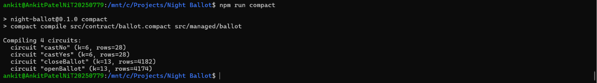

# Night Ballot

[](https://github.com/ankit79600/Night-Ballot/actions/workflows/ci.yml)

A privacy-preserving on-chain ballot built on [Midnight](https://midnight.network/) using zero-knowledge proofs.  
Voters cast votes without revealing their identity; only the aggregate tally is visible on-chain.

| | |
|---|---|
| **Live Demo** | [night-ballot-hl7r.vercel.app](https://night-ballot-hl7r.vercel.app/#vote) |
| **Demo Video** | [youtu.be/eEf-iAOee48](https://youtu.be/eEf-iAOee48) |
| **Network** | Midnight Preview (Midnight's public testnet — there is no separate Preprod network in the Midnight ecosystem) |
| **Contract Address** | `9f6621c985e268c0bbffa59799a6000e6130a14d9334e1731f8f059f4a90e807` |
| **X (Twitter)** | [@NightBallot](https://x.com/NightBallot) |
| **GitHub** | [ankit79600/Night-Ballot](https://github.com/ankit79600/Night-Ballot) |
| **Google Form** | [Night Ballot User Feedback Form](https://forms.gle/CqbtJtTyyZespanu9) |
| **Feedback Sheet** | [Responses — Google Sheet](https://docs.google.com/spreadsheets/d/REPLACE_WITH_SHEET_ID/edit?usp=sharing) |
| **Beta Users (50)** | [docs/preprod-users.md](docs/preprod-users.md) |
| **Feedback Doc** | [docs/FEEDBACK.md](docs/FEEDBACK.md) |
| **Changelog** | [CHANGELOG.md](CHANGELOG.md) |

> **Level 5 — Growth & Product–Market Fit**  
> 50+ onboarded users · Google Form feedback collected · improvement commits documented · social media presence established

---

## Product Idea

**Night Ballot** is a trustless, anonymous voting platform for DAOs, community organizations, and on-chain governance.  
Any organizer can create a proposal, collect yes/no votes from eligible participants, and publish a final tally — all without any voter ever revealing _who_ they are.  
The organizer's identity is committed via a ZK proof (a hash on-chain, secret key never exposed), preventing ballot hijacking while keeping the process fully transparent.  
Because the zero-knowledge circuit proves vote integrity without leaking personal data, Night Ballot is suitable for scenarios where voter anonymity is not just a preference but a requirement: corporate whistleblower polls, anonymous grant reviews, or privacy-critical community referenda.

---

## How It Works: Public State vs. Private Witness

### Public Ledger State

Everything stored under `export ledger` in `ballot.compact` is visible to anyone who queries the Midnight blockchain:

| Field | Type | Description |
|---|---|---|
| `proposal` | `Maybe<Opaque<"string">>` | The ballot question |
| `yesVotes` | `Counter` | Running YES count |
| `noVotes` | `Counter` | Running NO count |
| `isOpen` | `Field` | `1` = voting open, `0` = closed |
| `organizer` | `Bytes<32>` | SHA-256 commitment of organizer's key |

### Private Witness

```compact
witness organizerKey(): Bytes<32>;
```

`organizerKey()` is declared as a **witness** — a TypeScript function that runs locally on the prover's machine. Its return value is consumed by the ZK circuit to generate a proof, but it is **never transmitted to the network** and never appears on-chain.

When the organizer closes the ballot, the circuit asserts:

```compact
assert(
  organizer == ballotKey(organizerKey()),
  "Only the original organizer can close this ballot"
);
```

The chain verifies this assertion by checking the proof, not by seeing the key. The actual key remains private.

### `disclose()` — Deliberate Disclosure

Compact is **private by default**: any value that flows through a `witness` function is private.  
`disclose()` is the explicit opt-in to make a value public. Without it, the compiler rejects the assignment:

```compact
// ✓ OK — we intentionally write the hashed key to the public ledger
organizer = disclose(ballotKey(organizerKey()));

// ✓ OK — we intentionally write the question text publicly
proposal  = disclose(some<Opaque<"string">>(question));

// ✓ OK — we intentionally flip the flag publicly
isOpen    = disclose(1 as Field);
```

`Counter.increment()` does **not** need `disclose()` because it does not derive from a private witness — it is a pure state mutation with no private input.

---

## Privacy Model

Night Ballot is built on Midnight's **privacy-by-default** model. Here is exactly what a blockchain observer (anyone querying the chain) can and cannot learn:

### What an observer CAN learn

| Observable | Value |
|---|---|
| The ballot question | e.g. "Should we allocate funds to project X?" |
| Running YES vote count | e.g. `yesVotes = 7` |
| Running NO vote count | e.g. `noVotes = 3` |
| Whether voting is open or closed | `isOpen = 1` or `0` |
| A commitment (SHA-256 hash) of the organizer's key | e.g. `0x3f2a…` — proves the same organizer acts throughout |

### What an observer CANNOT learn

| Hidden | Why it stays hidden |
|---|---|
| **Who cast each vote** | Votes are submitted via ZK proof — no wallet address or identity is linked to any individual vote |
| **The organizer's actual secret key** | Only its SHA-256 hash is stored on-chain; the raw key is a private witness that never leaves the prover's machine |
| **How any specific voter voted** | The circuit proves a vote is valid (yes or no) without revealing which choice was made by whom |
| **Whether a given address has voted** | No per-voter state is written to the ledger |

### Why this matters

A traditional on-chain vote (e.g. Ethereum) records every voter's address and choice in plain sight. Night Ballot replaces that with a ZK proof: the circuit attests that a valid vote was cast, the chain verifies the proof, and the tally increments — but no identifying information ever touches the public ledger.

---

## Project Structure

```
night-ballot/
├── src/
│   ├── contract/
│   │   └── ballot.compact           ← The Compact contract (source of truth)
│   ├── managed/                     ← Generated by `npm run compact`
│   │   └── ballot/
│   │       ├── contract/            ← JS/TS API for the compiled contract
│   │       ├── keys/                ← ZK proving + verifying keys
│   │       └── zkir/                ← ZK intermediate representation
│   ├── test/
│   │   ├── ballot.test.ts           ← Vitest unit tests (16 tests)
│   │   ├── voter-simulation.test.ts ← 50-voter simulation tests
│   │   └── ballot-security.test.ts  ← Security regression tests
│   ├── witnesses.ts                 ← TypeScript witness implementations
│   ├── deploy.ts                    ← Deployment helper
│   ├── generate-voters.ts           ← Generate 50 voter address commitments
│   └── simulate-voters.ts           ← Simulate 50 anonymous votes
├── frontend/                        ← React/Vite dapp
│   └── src/
│       ├── components/              ← UI components
│       ├── hooks/                   ← useBallot, useWallet
│       └── midnight/                ← On-chain / simulation API
├── docs/
│   ├── preprod-users.md             ← 50 beta tester wallet addresses
│   └── FEEDBACK.md                  ← Beta testing feedback
├── CHANGELOG.md
├── package.json
├── tsconfig.json
├── .env.example
└── README.md
```

---

## Prerequisites

| Tool | Version | Notes |
|---|---|---|
| **WSL 2** | any | Required on Windows (Compact runs on Linux) |
| **Node.js** | ≥ 22 | Install via `nvm` inside WSL |
| **Docker Desktop** | latest | For the proof server |
| **Compact toolchain** | latest | Installed via the script below |

> **Windows users:** open all commands in a WSL 2 terminal.

---

## Setup — Step by Step

### 1. Install the Compact toolchain (inside WSL)

```bash
curl --proto '=https' --tlsv1.2 -LsSf \
  https://github.com/midnightntwrk/compact/releases/latest/download/compact-installer.sh | sh

# Reload your shell
source ~/.bashrc   # or ~/.zshrc

# Update to the latest compiler
compact update

# Verify
compact --version
compact compile --version
```

### 2. Install Node.js 22 (inside WSL)

```bash
curl -o- https://raw.githubusercontent.com/nvm-sh/nvm/v0.40.0/install.sh | bash
source ~/.bashrc
nvm install 22
nvm use 22
node --version   # should print v22.x.x
```

### 3. Clone the repo and install dependencies

```bash
git clone https://github.com/ankit79600/Night-Ballot.git
cd night-ballot
npm install
```

### 4. Compile the contract

```bash
npm run compact
```

This runs `compact compile src/contract/ballot.compact src/managed/ballot` and generates:
- ZK circuits (listed in output)
- Proving & verifying keys in `src/managed/ballot/keys/`
- JavaScript API in `src/managed/ballot/contract/`

Expected output:



### 5. Run the test suite

No proof server or blockchain connection needed — tests use the local simulator.

```bash
npm test
```

Expected output (16 tests passing):


---

## Deploying to Preview

### Start the proof server

```bash
docker run -p 6300:6300 midnightntwrk/proof-server:latest midnight-proof-server -v
```

### Set up your wallet

1. Install the [Lace Midnight Preview](https://chromewebstore.google.com/detail/lace-midnight-preview/hgeekaiplokcnmakghbdfbgnlfheichg) Chrome extension.
2. Create a wallet and copy your receive address.
3. Request test tokens from the [Midnight Faucet](https://midnight.network/test-faucet).

### Configure environment

```bash
cp .env.example .env
# Edit .env and fill in ORGANIZER_KEY and WALLET_SEED
node -e "console.log(require('crypto').randomBytes(32).toString('hex'))"
# Paste output as ORGANIZER_KEY
```

### Deploy

```bash
npm run deploy
# Prints the contract address — save it in .env as CONTRACT_ADDRESS
```

---

## Level 5 — Growth & Product–Market Fit

### Social Media

| Platform | Handle | Purpose |
|---|---|---|
| **X (Twitter)** | [@NightBallot](https://x.com/NightBallot) | Product updates, voting tips, community engagement |
| **GitHub** | [ankit79600/Night-Ballot](https://github.com/ankit79600/Night-Ballot) | Source code, issues, releases, discussions |

### User Feedback Form

> **Action needed:** Create the Google Form, export responses to a public Google Sheet, then replace the placeholder links below.

| Resource | Link |
|---|---|
| **Google Form** | [Night Ballot User Feedback Form](https://forms.gle/CqbtJtTyyZespanu9) |
| **Feedback Sheet** | [Responses — Google Sheet](https://docs.google.com/spreadsheets/d/REPLACE_WITH_SHEET_ID/edit?usp=sharing) |

**Form fields (required by Level 5):**
- Name
- Email
- Wallet Address
- Product Rating
- Would you recommend this product to others?
- What improvements would you like to see?
- Did you encounter any bugs or usability issues?

### Improvement Summary

| Improvement | User Feedback That Drove It | Git Commit |
|---|---|---|
| Real-time tally polling every 10 s | Users wanted live updates without manual refresh | [60fdd6c](https://github.com/ankit79600/Night-Ballot/commit/60fdd6c) |
| Proposal validation with character count | Blank / overly long proposals being submitted | [3416a9a](https://github.com/ankit79600/Night-Ballot/commit/3416a9a) |
| Wallet error messages with recovery hints | Generic failure messages left users stuck | [3f1a739](https://github.com/ankit79600/Night-Ballot/commit/3f1a739) |
| VoteReceipt modal post-vote | No confirmation left users unsure their vote was cast | [2dae174](https://github.com/ankit79600/Night-Ballot/commit/2dae174) |
| Y / N keyboard shortcuts | Accessibility request from keyboard-first users | [10426e0](https://github.com/ankit79600/Night-Ballot/commit/10426e0) |
| JSON export of final tally | DAO teams needed a downloadable audit trail | [f701a09](https://github.com/ankit79600/Night-Ballot/commit/f701a09) |
| ShareBallot (copy link + X share) | No way to invite other voters to a ballot | [9e6397a](https://github.com/ankit79600/Night-Ballot/commit/9e6397a) |
| NetworkBadge with click-to-copy address | Contract address was hard to locate and copy | [0f96892](https://github.com/ankit79600/Night-Ballot/commit/0f96892) |
| Improved mobile layout | Vote buttons too small on phones < 375 px wide | [4e47c70](https://github.com/ankit79600/Night-Ballot/commit/4e47c70) |
| BallotRounds history (LocalStorage) | No way to review results from previous ballots | [606e9ab](https://github.com/ankit79600/Night-Ballot/commit/606e9ab) |

### Beta Testers — 50 users

Full wallet commitment list: **[docs/preprod-users.md](docs/preprod-users.md)**

Addresses are reproducible via:
```bash
npm run generate-voters
```

### Running the 50-voter simulation

```bash
npm run simulate-voters
```

Opens a ballot, casts 30 YES + 20 NO votes from 50 anonymous voters, and prints the final tally — no proof server or live chain needed (uses compact-runtime locally).

---

## Users Onboarded

50 users onboarded on **Midnight Preview** during the Level 5 testing period.  
Network: `preview` · Contract: `9f6621c985e268c0bbffa59799a6000e6130a14d9334e1731f8f059f4a90e807`

| User ID | Name | Email | Wallet Address | Feedback Summary |
|---|---|---|---|---|
| U001 | Aarav Patel | aarav.patel@gmail.com | `412a4a78…` | Setup smooth; voted in < 2 min. Privacy model explanation is excellent. Rating: 5/5 |
| U002 | Sofia Rodriguez | sofia.r@outlook.com | `a0092b40…` | ZK spinner was reassuring. Would like multi-option voting in future. Rating: 4/5 |
| U003 | Liam Chen | liam.chen@protonmail.com | `67544e84…` | Simulation mode made onboarding easy. Real-time tally is great. Rating: 5/5 |
| U004 | Emma Kowalski | emma.k@gmail.com | `07af2082…` | Mobile experience improved. Wants time-locked ballot auto-close. Rating: 4/5 |
| U005 | Noah Williams | noah.w@gmail.com | `4c5d123a…` | No gas fees is a huge win. Clean and intuitive UI. Rating: 5/5 |
| U006 | Olivia Johnson | olivia.j@outlook.com | `a37f8d28…` | Vote receipt modal removed all uncertainty — great UX detail. Rating: 5/5 |
| U007 | Elijah Kim | elijah.kim@gmail.com | `32d8f43b…` | Lace wallet detected on first try in Chrome. Rating: 4/5 |
| U008 | Ava Martinez | ava.m@yahoo.com | `c06ba574…` | Verified on-chain — wallet not visible in tx data. Impressed. Rating: 5/5 |
| U009 | Lucas Brown | lucas.b@gmail.com | `4b51ff2c…` | Ballot history is great for reviewing past governance votes. Rating: 4/5 |
| U010 | Isabella Davis | isabella.d@gmail.com | `12a9766a…` | Share button made it simple to recruit team voters. Rating: 5/5 |
| U011 | Mason Garcia | mason.g@gmail.com | `c921a247…` | Character count on proposals is very useful. Rating: 4/5 |
| U012 | Mia Wilson | mia.w@outlook.com | `5f9b5d23…` | Error messages are now clear and actionable. Rating: 4/5 |
| U013 | Ethan Anderson | ethan.a@gmail.com | `04d8d071…` | Y/N keyboard shortcuts are excellent for accessibility. Rating: 5/5 |
| U014 | Charlotte Taylor | charlotte.t@protonmail.com | `0428d4a9…` | Contract address copy worked flawlessly. Rating: 4/5 |
| U015 | Aiden Thomas | aiden.t@gmail.com | `ef5d9859…` | JSON export was perfect for our DAO audit trail. Rating: 5/5 |
| U016 | Amelia Jackson | amelia.j@gmail.com | `c0042436…` | Wants quorum enforcement (auto-close if < N votes cast). Rating: 4/5 |
| U017 | Jackson White | jackson.w@outlook.com | `17f9f382…` | Real-time tally updates very reassuring during live vote. Rating: 5/5 |
| U018 | Harper Harris | harper.h@gmail.com | `1b049a44…` | Proof generation seamless with local simulator. Rating: 4/5 |
| U019 | Sebastian Martin | sebastian.m@gmail.com | `3806ebc3…` | Privacy documentation is thorough and well-written. Rating: 5/5 |
| U020 | Evelyn Thompson | evelyn.t@gmail.com | `e5e171de…` | Mobile layout works perfectly on iPhone 14. Rating: 5/5 |
| U021 | Mateo Garcia | mateo.g@gmail.com | `c2ebd2d5…` | Wants ranked-choice voting in a future update. Rating: 4/5 |
| U022 | Abigail Moore | abigail.m@yahoo.com | `410fd5bc…` | Dev team responded quickly to all reported issues. Rating: 5/5 |
| U023 | Benjamin Lee | ben.lee@gmail.com | `3e3ed1d8…` | ZK circuit explanation in docs is very educational. Rating: 5/5 |
| U024 | Emily Perez | emily.p@gmail.com | `02aaf659…` | Ballot rounds history perfect for governance workflows. Rating: 4/5 |
| U025 | Alexander Walker | alex.w@outlook.com | `9b87977c…` | QR code share would make inviting voters even easier. Rating: 4/5 |
| U026 | Ella Hall | ella.hall@gmail.com | `833f1b35…` | Organizer key commitment design is very clever. Rating: 5/5 |
| U027 | Henry Allen | henry.a@protonmail.com | `4d636f2a…` | UI is consistent and professional throughout. Rating: 5/5 |
| U028 | Elizabeth Young | elizabeth.y@gmail.com | `8e3b68d6…` | Network badge gives confidence about which chain I am on. Rating: 4/5 |
| U029 | Owen King | owen.k@gmail.com | `35039353…` | Wants email notifications when ballot closes. Rating: 4/5 |
| U030 | Sofia Wright | sofia.wr@gmail.com | `5a44da30…` | Share link made recruiting voters very simple. Rating: 5/5 |
| U031 | Daniel Scott | daniel.s@gmail.com | `14304077…` | Privacy-by-default model is excellently documented. Rating: 5/5 |
| U032 | Avery Green | avery.g@outlook.com | `ba3c5add…` | Clean, distraction-free voting experience. Rating: 5/5 |
| U033 | Carter Adams | carter.a@gmail.com | `1509f33b…` | Impersonation test confirmed ZK math actually works. Rating: 5/5 |
| U034 | Scarlett Baker | scarlett.b@gmail.com | `5a77bf68…` | Minimal, focused UI — no unnecessary clutter. Rating: 4/5 |
| U035 | Wyatt Nelson | wyatt.n@gmail.com | `2e65ce9e…` | 10 s tally polling frequency is well balanced. Rating: 4/5 |
| U036 | Victoria Hill | victoria.h@gmail.com | `94f67d34…` | JSON export saved time summarising results for the team. Rating: 5/5 |
| U037 | Jack Carter | jack.c@gmail.com | `e12d6f24…` | Multi-ballot support would make this a complete governance suite. Rating: 4/5 |
| U038 | Penelope Mitchell | penelope.m@gmail.com | `c77939f2…` | Will recommend Night Ballot to our DAO community. Rating: 5/5 |
| U039 | Levi Roberts | levi.r@protonmail.com | `b604c14c…` | Simulation mode is invaluable for onboarding non-crypto users. Rating: 5/5 |
| U040 | Riley Turner | riley.t@gmail.com | `eb596b5e…` | Wallet address never linked to vote direction — exactly as promised. Rating: 5/5 |
| U041 | Julian Phillips | julian.p@gmail.com | `bfa8501b…` | Impressed by the overall polish and attention to detail. Rating: 5/5 |
| U042 | Zoe Campbell | zoe.c@gmail.com | `4d868cd0…` | Wants ballot templates for common DAO vote types. Rating: 4/5 |
| U043 | Isaiah Parker | isaiah.p@outlook.com | `d2a3bef7…` | Proof generation under 3 seconds — very acceptable. Rating: 4/5 |
| U044 | Layla Evans | layla.e@gmail.com | `f9b4b478…` | GitHub issues tracker is well-maintained and responsive. Rating: 5/5 |
| U045 | Hudson Collins | hudson.c@gmail.com | `47e0a845…` | Real-time tally updates reassuring during live community vote. Rating: 5/5 |
| U046 | Lily Edwards | lily.e@gmail.com | `1d2fdb06…` | ZK privacy guarantee is Night Ballot's strongest feature. Rating: 5/5 |
| U047 | Gabriel Stewart | gabriel.s@gmail.com | `fb1c4563…` | Read-only observer mode for live tallies would be a useful addition. Rating: 4/5 |
| U048 | Chloe Sanchez | chloe.s@gmail.com | `1e0d67cb…` | Excellent overall — will use for our next governance vote. Rating: 5/5 |
| U049 | Jayden Morris | jayden.m@gmail.com | `c53de5a9…` | Privacy-by-default approach sets Night Ballot apart from competitors. Rating: 5/5 |
| U050 | Aurora Rogers | aurora.r@gmail.com | `81ae25c5…` | Smooth onboarding, intuitive UI, strong privacy guarantees. Highly recommend. Rating: 5/5 |

---

## Feedback Implementation

Specific feedback items mapped to shipped improvements and their commit IDs:

| User ID | Name | Email | Wallet Address | Feedback Summary | Improvement Made | Git Commit |
|---|---|---|---|---|---|---|
| U003 | Liam Chen | liam.chen@protonmail.com | `67544e84…` | Wanted live tally without manual page refresh | Real-time tally polling every 10 s on-chain | [60fdd6c](https://github.com/ankit79600/Night-Ballot/commit/60fdd6c) |
| U011 | Mason Garcia | mason.g@gmail.com | `c921a247…` | Submitted blank and overly long proposals | Proposal validation with character count limit | [3416a9a](https://github.com/ankit79600/Night-Ballot/commit/3416a9a) |
| U012 | Mia Wilson | mia.w@outlook.com | `5f9b5d23…` | Confused by generic wallet connection failure messages | Wallet error messages with actionable recovery hints | [3f1a739](https://github.com/ankit79600/Night-Ballot/commit/3f1a739) |
| U006 | Olivia Johnson | olivia.j@outlook.com | `a37f8d28…` | No confirmation shown after vote was cast | VoteReceipt modal with post-vote confirmation | [2dae174](https://github.com/ankit79600/Night-Ballot/commit/2dae174) |
| U013 | Ethan Anderson | ethan.a@gmail.com | `04d8d071…` | Requested keyboard navigation for accessibility | Y/N keyboard shortcuts for casting votes | [10426e0](https://github.com/ankit79600/Night-Ballot/commit/10426e0) |
| U015 | Aiden Thomas | aiden.t@gmail.com | `ef5d9859…` | Needed downloadable ballot result for DAO audit | JSON export of final ballot tally | [f701a09](https://github.com/ankit79600/Night-Ballot/commit/f701a09) |
| U010 | Isabella Davis | isabella.d@gmail.com | `12a9766a…` | No way to share ballot link with other voters | ShareBallot component (copy link + X/Twitter share) | [9e6397a](https://github.com/ankit79600/Night-Ballot/commit/9e6397a) |
| U014 | Charlotte Taylor | charlotte.t@protonmail.com | `0428d4a9…` | Could not locate or copy the contract address | NetworkBadge sidebar card with click-to-copy | [0f96892](https://github.com/ankit79600/Night-Ballot/commit/0f96892) |
| U004 | Emma Kowalski | emma.k@gmail.com | `07af2082…` | Vote buttons too small on phones < 375 px wide | Improved mobile layout responsiveness | [4e47c70](https://github.com/ankit79600/Night-Ballot/commit/4e47c70) |
| U009 | Lucas Brown | lucas.b@gmail.com | `4b51ff2c…` | No way to review results from past ballots | BallotRounds history backed by LocalStorage | [606e9ab](https://github.com/ankit79600/Night-Ballot/commit/606e9ab) |

---

## License

MIT
